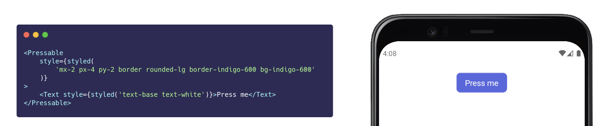

# React Native Restyled

> A Utility-first Styling Library for [React Native][rn].



## Features

- **Zero-overhead:** A Babel macro is used to compile the style string to optimized `StyleSheet.create` objects.
- **Variants support:** For having two Button variants, Responsive layout, Platform specific styles, or event Dark mode. Variants can do it all.
- **Customizable:** Simply add a `styled.config.js` and get creative.

## Usage

> _Requires React Native v0.62.0 or higher_

```
yarn add react-native-restyled
```

**Example:**

```jsx
import { styled } from 'react-native-restyled';

const Button = ({ primary, text }) => (
	<Pressable
		onPress={() => {}}
		style={styled(
			`mx-2 px-4 py-2
			 border rounded-md border-gray-300 bg-white
			 primary:border-indigo-600 primary:bg-indigo-600`,
			{ primary }
		)}
	>
		<Text
			style={styled(
				`text-base text-indigo-600
				 primary:text-white`,
				{ primary }
			)}
		>
			{text}
		</Text>
	</Pressable>
);
```

## Concepts

**Utility-First**

TODO

**Variants**

TODO

## Utilities

<!-- UTILITIES-START -->

### Backgrounds

<details><summary>Background Color</summary>

| Style          | Properties                          |
| -------------- | ----------------------------------- |
| bg-black       | `{"backgroundColor":"black"}`       |
| bg-white       | `{"backgroundColor":"white"}`       |
| bg-transparent | `{"backgroundColor":"transparent"}` |
| bg-gray-100    | `{"backgroundColor":"#f7fafc"}`     |
| bg-gray-200    | `{"backgroundColor":"#edf2f7"}`     |
| bg-gray-300    | `{"backgroundColor":"#e2e8f0"}`     |
| bg-gray-400    | `{"backgroundColor":"#cbd5e0"}`     |
| bg-gray-500    | `{"backgroundColor":"#a0aec0"}`     |
| bg-gray-600    | `{"backgroundColor":"#718096"}`     |
| bg-gray-700    | `{"backgroundColor":"#4a5568"}`     |
| bg-gray-800    | `{"backgroundColor":"#2d3748"}`     |
| bg-gray-900    | `{"backgroundColor":"#1a202c"}`     |
| bg-red-100     | `{"backgroundColor":"#fff5f5"}`     |
| bg-red-200     | `{"backgroundColor":"#fed7d7"}`     |
| bg-red-300     | `{"backgroundColor":"#feb2b2"}`     |
| bg-red-400     | `{"backgroundColor":"#fc8181"}`     |
| bg-red-500     | `{"backgroundColor":"#f56565"}`     |
| bg-red-600     | `{"backgroundColor":"#e53e3e"}`     |
| bg-red-700     | `{"backgroundColor":"#c53030"}`     |
| bg-red-800     | `{"backgroundColor":"#9b2c2c"}`     |
| bg-red-900     | `{"backgroundColor":"#742a2a"}`     |
| bg-orange-100  | `{"backgroundColor":"#fffaf0"}`     |
| bg-orange-200  | `{"backgroundColor":"#feebc8"}`     |
| bg-orange-300  | `{"backgroundColor":"#fbd38d"}`     |
| bg-orange-400  | `{"backgroundColor":"#f6ad55"}`     |
| bg-orange-500  | `{"backgroundColor":"#ed8936"}`     |
| bg-orange-600  | `{"backgroundColor":"#dd6b20"}`     |
| bg-orange-700  | `{"backgroundColor":"#c05621"}`     |
| bg-orange-800  | `{"backgroundColor":"#9c4221"}`     |
| bg-orange-900  | `{"backgroundColor":"#7b341e"}`     |
| bg-yellow-100  | `{"backgroundColor":"#fffff0"}`     |
| bg-yellow-200  | `{"backgroundColor":"#fefcbf"}`     |
| bg-yellow-300  | `{"backgroundColor":"#faf089"}`     |
| bg-yellow-400  | `{"backgroundColor":"#f6e05e"}`     |
| bg-yellow-500  | `{"backgroundColor":"#ecc94b"}`     |
| bg-yellow-600  | `{"backgroundColor":"#d69e2e"}`     |
| bg-yellow-700  | `{"backgroundColor":"#b7791f"}`     |
| bg-yellow-800  | `{"backgroundColor":"#975a16"}`     |
| bg-yellow-900  | `{"backgroundColor":"#744210"}`     |
| bg-green-100   | `{"backgroundColor":"#f0fff4"}`     |
| bg-green-200   | `{"backgroundColor":"#c6f6d5"}`     |
| bg-green-300   | `{"backgroundColor":"#9ae6b4"}`     |
| bg-green-400   | `{"backgroundColor":"#68d391"}`     |
| bg-green-500   | `{"backgroundColor":"#48bb78"}`     |
| bg-green-600   | `{"backgroundColor":"#38a169"}`     |
| bg-green-700   | `{"backgroundColor":"#2f855a"}`     |
| bg-green-800   | `{"backgroundColor":"#276749"}`     |
| bg-green-900   | `{"backgroundColor":"#22543d"}`     |
| bg-teal-100    | `{"backgroundColor":"#e6fffa"}`     |
| bg-teal-200    | `{"backgroundColor":"#b2f5ea"}`     |
| bg-teal-300    | `{"backgroundColor":"#81e6d9"}`     |
| bg-teal-400    | `{"backgroundColor":"#4fd1c5"}`     |
| bg-teal-500    | `{"backgroundColor":"#38b2ac"}`     |
| bg-teal-600    | `{"backgroundColor":"#319795"}`     |
| bg-teal-700    | `{"backgroundColor":"#2c7a7b"}`     |
| bg-teal-800    | `{"backgroundColor":"#285e61"}`     |
| bg-teal-900    | `{"backgroundColor":"#234e52"}`     |
| bg-blue-100    | `{"backgroundColor":"#ebf8ff"}`     |
| bg-blue-200    | `{"backgroundColor":"#bee3f8"}`     |
| bg-blue-300    | `{"backgroundColor":"#90cdf4"}`     |
| bg-blue-400    | `{"backgroundColor":"#63b3ed"}`     |
| bg-blue-500    | `{"backgroundColor":"#4299e1"}`     |
| bg-blue-600    | `{"backgroundColor":"#3182ce"}`     |
| bg-blue-700    | `{"backgroundColor":"#2b6cb0"}`     |
| bg-blue-800    | `{"backgroundColor":"#2c5282"}`     |
| bg-blue-900    | `{"backgroundColor":"#2a4365"}`     |
| bg-indigo-100  | `{"backgroundColor":"#ebf4ff"}`     |
| bg-indigo-200  | `{"backgroundColor":"#c3dafe"}`     |
| bg-indigo-300  | `{"backgroundColor":"#a3bffa"}`     |
| bg-indigo-400  | `{"backgroundColor":"#7f9cf5"}`     |
| bg-indigo-500  | `{"backgroundColor":"#667eea"}`     |
| bg-indigo-600  | `{"backgroundColor":"#5a67d8"}`     |
| bg-indigo-700  | `{"backgroundColor":"#4c51bf"}`     |
| bg-indigo-800  | `{"backgroundColor":"#434190"}`     |
| bg-indigo-900  | `{"backgroundColor":"#3c366b"}`     |
| bg-purple-100  | `{"backgroundColor":"#faf5ff"}`     |
| bg-purple-200  | `{"backgroundColor":"#e9d8fd"}`     |
| bg-purple-300  | `{"backgroundColor":"#d6bcfa"}`     |
| bg-purple-400  | `{"backgroundColor":"#b794f4"}`     |
| bg-purple-500  | `{"backgroundColor":"#9f7aea"}`     |
| bg-purple-600  | `{"backgroundColor":"#805ad5"}`     |
| bg-purple-700  | `{"backgroundColor":"#6b46c1"}`     |
| bg-purple-800  | `{"backgroundColor":"#553c9a"}`     |
| bg-purple-900  | `{"backgroundColor":"#44337a"}`     |
| bg-pink-100    | `{"backgroundColor":"#fff5f7"}`     |
| bg-pink-200    | `{"backgroundColor":"#fed7e2"}`     |
| bg-pink-300    | `{"backgroundColor":"#fbb6ce"}`     |
| bg-pink-400    | `{"backgroundColor":"#f687b3"}`     |
| bg-pink-500    | `{"backgroundColor":"#ed64a6"}`     |
| bg-pink-600    | `{"backgroundColor":"#d53f8c"}`     |
| bg-pink-700    | `{"backgroundColor":"#b83280"}`     |
| bg-pink-800    | `{"backgroundColor":"#97266d"}`     |
| bg-pink-900    | `{"backgroundColor":"#702459"}`     |

</details>

### Borders

<details><summary>Border Color</summary>

| Style              | Properties                      |
| ------------------ | ------------------------------- |
| border-black       | `{"borderColor":"black"}`       |
| border-white       | `{"borderColor":"white"}`       |
| border-transparent | `{"borderColor":"transparent"}` |
| border-gray-100    | `{"borderColor":"#f7fafc"}`     |
| border-gray-200    | `{"borderColor":"#edf2f7"}`     |
| border-gray-300    | `{"borderColor":"#e2e8f0"}`     |
| border-gray-400    | `{"borderColor":"#cbd5e0"}`     |
| border-gray-500    | `{"borderColor":"#a0aec0"}`     |
| border-gray-600    | `{"borderColor":"#718096"}`     |
| border-gray-700    | `{"borderColor":"#4a5568"}`     |
| border-gray-800    | `{"borderColor":"#2d3748"}`     |
| border-gray-900    | `{"borderColor":"#1a202c"}`     |
| border-red-100     | `{"borderColor":"#fff5f5"}`     |
| border-red-200     | `{"borderColor":"#fed7d7"}`     |
| border-red-300     | `{"borderColor":"#feb2b2"}`     |
| border-red-400     | `{"borderColor":"#fc8181"}`     |
| border-red-500     | `{"borderColor":"#f56565"}`     |
| border-red-600     | `{"borderColor":"#e53e3e"}`     |
| border-red-700     | `{"borderColor":"#c53030"}`     |
| border-red-800     | `{"borderColor":"#9b2c2c"}`     |
| border-red-900     | `{"borderColor":"#742a2a"}`     |
| border-orange-100  | `{"borderColor":"#fffaf0"}`     |
| border-orange-200  | `{"borderColor":"#feebc8"}`     |
| border-orange-300  | `{"borderColor":"#fbd38d"}`     |
| border-orange-400  | `{"borderColor":"#f6ad55"}`     |
| border-orange-500  | `{"borderColor":"#ed8936"}`     |
| border-orange-600  | `{"borderColor":"#dd6b20"}`     |
| border-orange-700  | `{"borderColor":"#c05621"}`     |
| border-orange-800  | `{"borderColor":"#9c4221"}`     |
| border-orange-900  | `{"borderColor":"#7b341e"}`     |
| border-yellow-100  | `{"borderColor":"#fffff0"}`     |
| border-yellow-200  | `{"borderColor":"#fefcbf"}`     |
| border-yellow-300  | `{"borderColor":"#faf089"}`     |
| border-yellow-400  | `{"borderColor":"#f6e05e"}`     |
| border-yellow-500  | `{"borderColor":"#ecc94b"}`     |
| border-yellow-600  | `{"borderColor":"#d69e2e"}`     |
| border-yellow-700  | `{"borderColor":"#b7791f"}`     |
| border-yellow-800  | `{"borderColor":"#975a16"}`     |
| border-yellow-900  | `{"borderColor":"#744210"}`     |
| border-green-100   | `{"borderColor":"#f0fff4"}`     |
| border-green-200   | `{"borderColor":"#c6f6d5"}`     |
| border-green-300   | `{"borderColor":"#9ae6b4"}`     |
| border-green-400   | `{"borderColor":"#68d391"}`     |
| border-green-500   | `{"borderColor":"#48bb78"}`     |
| border-green-600   | `{"borderColor":"#38a169"}`     |
| border-green-700   | `{"borderColor":"#2f855a"}`     |
| border-green-800   | `{"borderColor":"#276749"}`     |
| border-green-900   | `{"borderColor":"#22543d"}`     |
| border-teal-100    | `{"borderColor":"#e6fffa"}`     |
| border-teal-200    | `{"borderColor":"#b2f5ea"}`     |
| border-teal-300    | `{"borderColor":"#81e6d9"}`     |
| border-teal-400    | `{"borderColor":"#4fd1c5"}`     |
| border-teal-500    | `{"borderColor":"#38b2ac"}`     |
| border-teal-600    | `{"borderColor":"#319795"}`     |
| border-teal-700    | `{"borderColor":"#2c7a7b"}`     |
| border-teal-800    | `{"borderColor":"#285e61"}`     |
| border-teal-900    | `{"borderColor":"#234e52"}`     |
| border-blue-100    | `{"borderColor":"#ebf8ff"}`     |
| border-blue-200    | `{"borderColor":"#bee3f8"}`     |
| border-blue-300    | `{"borderColor":"#90cdf4"}`     |
| border-blue-400    | `{"borderColor":"#63b3ed"}`     |
| border-blue-500    | `{"borderColor":"#4299e1"}`     |
| border-blue-600    | `{"borderColor":"#3182ce"}`     |
| border-blue-700    | `{"borderColor":"#2b6cb0"}`     |
| border-blue-800    | `{"borderColor":"#2c5282"}`     |
| border-blue-900    | `{"borderColor":"#2a4365"}`     |
| border-indigo-100  | `{"borderColor":"#ebf4ff"}`     |
| border-indigo-200  | `{"borderColor":"#c3dafe"}`     |
| border-indigo-300  | `{"borderColor":"#a3bffa"}`     |
| border-indigo-400  | `{"borderColor":"#7f9cf5"}`     |
| border-indigo-500  | `{"borderColor":"#667eea"}`     |
| border-indigo-600  | `{"borderColor":"#5a67d8"}`     |
| border-indigo-700  | `{"borderColor":"#4c51bf"}`     |
| border-indigo-800  | `{"borderColor":"#434190"}`     |
| border-indigo-900  | `{"borderColor":"#3c366b"}`     |
| border-purple-100  | `{"borderColor":"#faf5ff"}`     |
| border-purple-200  | `{"borderColor":"#e9d8fd"}`     |
| border-purple-300  | `{"borderColor":"#d6bcfa"}`     |
| border-purple-400  | `{"borderColor":"#b794f4"}`     |
| border-purple-500  | `{"borderColor":"#9f7aea"}`     |
| border-purple-600  | `{"borderColor":"#805ad5"}`     |
| border-purple-700  | `{"borderColor":"#6b46c1"}`     |
| border-purple-800  | `{"borderColor":"#553c9a"}`     |
| border-purple-900  | `{"borderColor":"#44337a"}`     |
| border-pink-100    | `{"borderColor":"#fff5f7"}`     |
| border-pink-200    | `{"borderColor":"#fed7e2"}`     |
| border-pink-300    | `{"borderColor":"#fbb6ce"}`     |
| border-pink-400    | `{"borderColor":"#f687b3"}`     |
| border-pink-500    | `{"borderColor":"#ed64a6"}`     |
| border-pink-600    | `{"borderColor":"#d53f8c"}`     |
| border-pink-700    | `{"borderColor":"#b83280"}`     |
| border-pink-800    | `{"borderColor":"#97266d"}`     |
| border-pink-900    | `{"borderColor":"#702459"}`     |

</details>

<details><summary>Border Radius</summary>

| Style           | Properties                                                       |
| --------------- | ---------------------------------------------------------------- |
| rounded-none    | `{"borderRadius":0}`                                             |
| rounded-sm      | `{"borderRadius":4}`                                             |
| rounded-md      | `{"borderRadius":12}`                                            |
| rounded-lg      | `{"borderRadius":16}`                                            |
| rounded-xl      | `{"borderRadius":24}`                                            |
| rounded-2xl     | `{"borderRadius":32}`                                            |
| rounded-3xl     | `{"borderRadius":48}`                                            |
| rounded-full    | `{"borderRadius":9999}`                                          |
| rounded         | `{"borderRadius":8}`                                             |
| rounded-t-none  | `{"borderTopLeftRadius":0,"borderTopRightRadius":0}`             |
| rounded-t-sm    | `{"borderTopLeftRadius":4,"borderTopRightRadius":4}`             |
| rounded-t-md    | `{"borderTopLeftRadius":12,"borderTopRightRadius":12}`           |
| rounded-t-lg    | `{"borderTopLeftRadius":16,"borderTopRightRadius":16}`           |
| rounded-t-xl    | `{"borderTopLeftRadius":24,"borderTopRightRadius":24}`           |
| rounded-t-2xl   | `{"borderTopLeftRadius":32,"borderTopRightRadius":32}`           |
| rounded-t-3xl   | `{"borderTopLeftRadius":48,"borderTopRightRadius":48}`           |
| rounded-t-full  | `{"borderTopLeftRadius":9999,"borderTopRightRadius":9999}`       |
| rounded-t       | `{"borderTopLeftRadius":8,"borderTopRightRadius":8}`             |
| rounded-b-none  | `{"borderBottomRightRadius":0,"borderBottomLeftRadius":0}`       |
| rounded-b-sm    | `{"borderBottomRightRadius":4,"borderBottomLeftRadius":4}`       |
| rounded-b-md    | `{"borderBottomRightRadius":12,"borderBottomLeftRadius":12}`     |
| rounded-b-lg    | `{"borderBottomRightRadius":16,"borderBottomLeftRadius":16}`     |
| rounded-b-xl    | `{"borderBottomRightRadius":24,"borderBottomLeftRadius":24}`     |
| rounded-b-2xl   | `{"borderBottomRightRadius":32,"borderBottomLeftRadius":32}`     |
| rounded-b-3xl   | `{"borderBottomRightRadius":48,"borderBottomLeftRadius":48}`     |
| rounded-b-full  | `{"borderBottomRightRadius":9999,"borderBottomLeftRadius":9999}` |
| rounded-b       | `{"borderBottomRightRadius":8,"borderBottomLeftRadius":8}`       |
| rounded-l-none  | `{"borderTopLeftRadius":0,"borderBottomLeftRadius":0}`           |
| rounded-l-sm    | `{"borderTopLeftRadius":4,"borderBottomLeftRadius":4}`           |
| rounded-l-md    | `{"borderTopLeftRadius":12,"borderBottomLeftRadius":12}`         |
| rounded-l-lg    | `{"borderTopLeftRadius":16,"borderBottomLeftRadius":16}`         |
| rounded-l-xl    | `{"borderTopLeftRadius":24,"borderBottomLeftRadius":24}`         |
| rounded-l-2xl   | `{"borderTopLeftRadius":32,"borderBottomLeftRadius":32}`         |
| rounded-l-3xl   | `{"borderTopLeftRadius":48,"borderBottomLeftRadius":48}`         |
| rounded-l-full  | `{"borderTopLeftRadius":9999,"borderBottomLeftRadius":9999}`     |
| rounded-l       | `{"borderTopLeftRadius":8,"borderBottomLeftRadius":8}`           |
| rounded-r-none  | `{"borderTopRightRadius":0,"borderBottomRightRadius":0}`         |
| rounded-r-sm    | `{"borderTopRightRadius":4,"borderBottomRightRadius":4}`         |
| rounded-r-md    | `{"borderTopRightRadius":12,"borderBottomRightRadius":12}`       |
| rounded-r-lg    | `{"borderTopRightRadius":16,"borderBottomRightRadius":16}`       |
| rounded-r-xl    | `{"borderTopRightRadius":24,"borderBottomRightRadius":24}`       |
| rounded-r-2xl   | `{"borderTopRightRadius":32,"borderBottomRightRadius":32}`       |
| rounded-r-3xl   | `{"borderTopRightRadius":48,"borderBottomRightRadius":48}`       |
| rounded-r-full  | `{"borderTopRightRadius":9999,"borderBottomRightRadius":9999}`   |
| rounded-r       | `{"borderTopRightRadius":8,"borderBottomRightRadius":8}`         |
| rounded-tl-none | `{"borderTopLeftRadius":0}`                                      |
| rounded-tl-sm   | `{"borderTopLeftRadius":4}`                                      |
| rounded-tl-md   | `{"borderTopLeftRadius":12}`                                     |
| rounded-tl-lg   | `{"borderTopLeftRadius":16}`                                     |
| rounded-tl-xl   | `{"borderTopLeftRadius":24}`                                     |
| rounded-tl-2xl  | `{"borderTopLeftRadius":32}`                                     |
| rounded-tl-3xl  | `{"borderTopLeftRadius":48}`                                     |
| rounded-tl-full | `{"borderTopLeftRadius":9999}`                                   |
| rounded-tl      | `{"borderTopLeftRadius":8}`                                      |
| rounded-tr-none | `{"borderTopRightRadius":0}`                                     |
| rounded-tr-sm   | `{"borderTopRightRadius":4}`                                     |
| rounded-tr-md   | `{"borderTopRightRadius":12}`                                    |
| rounded-tr-lg   | `{"borderTopRightRadius":16}`                                    |
| rounded-tr-xl   | `{"borderTopRightRadius":24}`                                    |
| rounded-tr-2xl  | `{"borderTopRightRadius":32}`                                    |
| rounded-tr-3xl  | `{"borderTopRightRadius":48}`                                    |
| rounded-tr-full | `{"borderTopRightRadius":9999}`                                  |
| rounded-tr      | `{"borderTopRightRadius":8}`                                     |
| rounded-bl-none | `{"borderBottomLeftRadius":0}`                                   |
| rounded-bl-sm   | `{"borderBottomLeftRadius":4}`                                   |
| rounded-bl-md   | `{"borderBottomLeftRadius":12}`                                  |
| rounded-bl-lg   | `{"borderBottomLeftRadius":16}`                                  |
| rounded-bl-xl   | `{"borderBottomLeftRadius":24}`                                  |
| rounded-bl-2xl  | `{"borderBottomLeftRadius":32}`                                  |
| rounded-bl-3xl  | `{"borderBottomLeftRadius":48}`                                  |
| rounded-bl-full | `{"borderBottomLeftRadius":9999}`                                |
| rounded-bl      | `{"borderBottomLeftRadius":8}`                                   |
| rounded-br-none | `{"borderBottomRightRadius":0}`                                  |
| rounded-br-sm   | `{"borderBottomRightRadius":4}`                                  |
| rounded-br-md   | `{"borderBottomRightRadius":12}`                                 |
| rounded-br-lg   | `{"borderBottomRightRadius":16}`                                 |
| rounded-br-xl   | `{"borderBottomRightRadius":24}`                                 |
| rounded-br-2xl  | `{"borderBottomRightRadius":32}`                                 |
| rounded-br-3xl  | `{"borderBottomRightRadius":48}`                                 |
| rounded-br-full | `{"borderBottomRightRadius":9999}`                               |
| rounded-br      | `{"borderBottomRightRadius":8}`                                  |
| rounded-ts-none | `{"borderTopStartRadius":0}`                                     |
| rounded-ts-sm   | `{"borderTopStartRadius":4}`                                     |
| rounded-ts-md   | `{"borderTopStartRadius":12}`                                    |
| rounded-ts-lg   | `{"borderTopStartRadius":16}`                                    |
| rounded-ts-xl   | `{"borderTopStartRadius":24}`                                    |
| rounded-ts-2xl  | `{"borderTopStartRadius":32}`                                    |
| rounded-ts-3xl  | `{"borderTopStartRadius":48}`                                    |
| rounded-ts-full | `{"borderTopStartRadius":9999}`                                  |
| rounded-ts      | `{"borderTopStartRadius":8}`                                     |
| rounded-te-none | `{"borderTopEndRadius":0}`                                       |
| rounded-te-sm   | `{"borderTopEndRadius":4}`                                       |
| rounded-te-md   | `{"borderTopEndRadius":12}`                                      |
| rounded-te-lg   | `{"borderTopEndRadius":16}`                                      |
| rounded-te-xl   | `{"borderTopEndRadius":24}`                                      |
| rounded-te-2xl  | `{"borderTopEndRadius":32}`                                      |
| rounded-te-3xl  | `{"borderTopEndRadius":48}`                                      |
| rounded-te-full | `{"borderTopEndRadius":9999}`                                    |
| rounded-te      | `{"borderTopEndRadius":8}`                                       |

</details>

<details><summary>Border Style</summary>

| Style         | Properties                 |
| ------------- | -------------------------- |
| border-solid  | `{"borderStyle":"solid"}`  |
| border-dotted | `{"borderStyle":"dotted"}` |
| border-dashed | `{"borderStyle":"dashed"}` |

</details>

<details><summary>Border Width</summary>

| Style      | Properties                |
| ---------- | ------------------------- |
| border-0   | `{"borderWidth":0}`       |
| border-2   | `{"borderWidth":2}`       |
| border-4   | `{"borderWidth":4}`       |
| border-8   | `{"borderWidth":8}`       |
| border     | `{"borderWidth":1}`       |
| border-t-0 | `{"borderTopWidth":0}`    |
| border-t-2 | `{"borderTopWidth":2}`    |
| border-t-4 | `{"borderTopWidth":4}`    |
| border-t-8 | `{"borderTopWidth":8}`    |
| border-t   | `{"borderTopWidth":1}`    |
| border-l-0 | `{"borderLeftWidth":0}`   |
| border-l-2 | `{"borderLeftWidth":2}`   |
| border-l-4 | `{"borderLeftWidth":4}`   |
| border-l-8 | `{"borderLeftWidth":8}`   |
| border-l   | `{"borderLeftWidth":1}`   |
| border-r-0 | `{"borderRightWidth":0}`  |
| border-r-2 | `{"borderRightWidth":2}`  |
| border-r-4 | `{"borderRightWidth":4}`  |
| border-r-8 | `{"borderRightWidth":8}`  |
| border-r   | `{"borderRightWidth":1}`  |
| border-b-0 | `{"borderBottomWidth":0}` |
| border-b-2 | `{"borderBottomWidth":2}` |
| border-b-4 | `{"borderBottomWidth":4}` |
| border-b-8 | `{"borderBottomWidth":8}` |
| border-b   | `{"borderBottomWidth":1}` |
| border-s-0 | `{"borderStartWidth":0}`  |
| border-s-2 | `{"borderStartWidth":2}`  |
| border-s-4 | `{"borderStartWidth":4}`  |
| border-s-8 | `{"borderStartWidth":8}`  |
| border-s   | `{"borderStartWidth":1}`  |
| border-e-0 | `{"borderEndWidth":0}`    |
| border-e-2 | `{"borderEndWidth":2}`    |
| border-e-4 | `{"borderEndWidth":4}`    |
| border-e-8 | `{"borderEndWidth":8}`    |
| border-e   | `{"borderEndWidth":1}`    |

</details>

### Effects

<details><summary>Opacity</summary>

| Style       | Properties         |
| ----------- | ------------------ |
| opacity-0   | `{"opacity":0}`    |
| opacity-25  | `{"opacity":0.25}` |
| opacity-50  | `{"opacity":0.5}`  |
| opacity-75  | `{"opacity":0.75}` |
| opacity-100 | `{"opacity":1}`    |

</details>

### Flex

<details><summary>Align Content</summary>

| Style           | Properties                         |
| --------------- | ---------------------------------- |
| content-stretch | `{"alignContent":"stretch"}`       |
| content-center  | `{"alignContent":"center"}`        |
| content-start   | `{"alignContent":"flex-start"}`    |
| content-end     | `{"alignContent":"flex-end"}`      |
| content-between | `{"alignContent":"space-between"}` |
| content-around  | `{"alignContent":"space-around"}`  |

</details>

<details><summary>Align Items</summary>

| Style          | Properties                    |
| -------------- | ----------------------------- |
| items-start    | `{"alignItems":"flex-start"}` |
| items-end      | `{"alignItems":"flex-end"}`   |
| items-baseline | `{"alignItems":"baseline"}`   |
| items-stretch  | `{"alignItems":"stretch"}`    |
| items-center   | `{"alignItems":"center"}`     |

</details>

<details><summary>Align Self</summary>

| Style        | Properties                   |
| ------------ | ---------------------------- |
| self-start   | `{"alignSelf":"flex-start"}` |
| self-end     | `{"alignSelf":"flex-end"}`   |
| self-auto    | `{"alignSelf":"auto"}`       |
| self-stretch | `{"alignSelf":"stretch"}`    |
| self-center  | `{"alignSelf":"center"}`     |

</details>

<details><summary>Flex Direction</summary>

| Style            | Properties                           |
| ---------------- | ------------------------------------ |
| flex-row         | `{"flexDirection":"row"}`            |
| flex-row-reverse | `{"flexDirection":"row-reverse"}`    |
| flex-col         | `{"flexDirection":"column"}`         |
| flex-col-reverse | `{"flexDirection":"column-reverse"}` |

</details>

<details><summary>Flex Grow</summary>

| Style       | Properties       |
| ----------- | ---------------- |
| flex-grow-0 | `{"flexGrow":0}` |
| flex-grow   | `{"flexGrow":1}` |

</details>

<details><summary>Flex Shrink</summary>

| Style         | Properties         |
| ------------- | ------------------ |
| flex-shrink-0 | `{"flexShrink":0}` |
| flex-shrink   | `{"flexShrink":1}` |

</details>

<details><summary>Flex Wrap</summary>

| Style             | Properties                    |
| ----------------- | ----------------------------- |
| flex-no-wrap      | `{"flexWrap":"nowrap"}`       |
| flex-wrap         | `{"flexWrap":"wrap"}`         |
| flex-wrap-reverse | `{"flexWrap":"wrap-reverse"}` |

</details>

<details><summary>Flex</summary>

| Style        | Properties                                         |
| ------------ | -------------------------------------------------- |
| flex-1       | `{"flexGrow":1,"flexShrink":1,"flexBasis":"0%"}`   |
| flex-auto    | `{"flexGrow":1,"flexShrink":1,"flexBasis":"auto"}` |
| flex-initial | `{"flexGrow":0,"flexShrink":1,"flexBasis":"auto"}` |
| flex-none    | `{"flexGrow":0,"flexShrink":0,"flexBasis":"auto"}` |

</details>

<details><summary>Justify Content</summary>

| Style           | Properties                           |
| --------------- | ------------------------------------ |
| justify-center  | `{"justifyContent":"center"}`        |
| justify-start   | `{"justifyContent":"flex-start"}`    |
| justify-end     | `{"justifyContent":"flex-end"}`      |
| justify-between | `{"justifyContent":"space-between"}` |
| justify-around  | `{"justifyContent":"space-around"}`  |
| justify-evenly  | `{"justifyContent":"space-evenly"}`  |

</details>

### Layout

<details><summary>Container</summary>

| Style        | Properties                         |
| ------------ | ---------------------------------- |
| container    | `{"width":"100%"}`                 |
| container-sm | `{"width":"100%","maxWidth":640}`  |
| container-md | `{"width":"100%","maxWidth":768}`  |
| container-lg | `{"width":"100%","maxWidth":1024}` |
| container-xl | `{"width":"100%","maxWidth":1280}` |

</details>

<details><summary>Display</summary>

| Style  | Properties           |
| ------ | -------------------- |
| flex   | `{"display":"flex"}` |
| hidden | `{"display":"none"}` |

</details>

<details><summary>Overflow</summary>

| Style            | Properties               |
| ---------------- | ------------------------ |
| overflow-hidden  | `{"overflow":"hidden"}`  |
| overflow-scroll  | `{"overflow":"scroll"}`  |
| overflow-visible | `{"overflow":"visible"}` |

</details>

<details><summary>Position</summary>

| Style    | Properties                |
| -------- | ------------------------- |
| absolute | `{"position":"absolute"}` |
| relative | `{"position":"relative"}` |

</details>

<details><summary>Top / Right / Bottom / Left</summary>

| Style     | Properties                                |
| --------- | ----------------------------------------- |
| inset-0   | `{"top":0,"right":0,"bottom":0,"left":0}` |
| inset-y-0 | `{"top":0,"bottom":0}`                    |
| inset-x-0 | `{"right":0,"left":0}`                    |
| top-0     | `{"top":0}`                               |
| right-0   | `{"right":0}`                             |
| bottom-0  | `{"bottom":0}`                            |
| left-0    | `{"left":0}`                              |

</details>

<details><summary>Z-Index</summary>

| Style | Properties      |
| ----- | --------------- |
| z-0   | `{"zIndex":0}`  |
| z-10  | `{"zIndex":10}` |
| z-20  | `{"zIndex":20}` |
| z-30  | `{"zIndex":30}` |
| z-40  | `{"zIndex":40}` |
| z-50  | `{"zIndex":50}` |

</details>

### Sizing

<details><summary>Height</summary>

| Style | Properties       |
| ----- | ---------------- |
| h-0   | `{"height":0}`   |
| h-1   | `{"height":8}`   |
| h-2   | `{"height":16}`  |
| h-3   | `{"height":24}`  |
| h-4   | `{"height":32}`  |
| h-5   | `{"height":40}`  |
| h-6   | `{"height":48}`  |
| h-8   | `{"height":64}`  |
| h-10  | `{"height":80}`  |
| h-12  | `{"height":96}`  |
| h-16  | `{"height":128}` |
| h-20  | `{"height":160}` |
| h-24  | `{"height":192}` |
| h-32  | `{"height":256}` |
| h-40  | `{"height":320}` |
| h-48  | `{"height":384}` |
| h-56  | `{"height":448}` |
| h-64  | `{"height":512}` |
| h-px  | `{"height":1}`   |

</details>

<details><summary>Max-Height</summary>

| Style      | Properties             |
| ---------- | ---------------------- |
| max-h-full | `{"maxHeight":"100%"}` |

</details>

<details><summary>Max-Width</summary>

| Style           | Properties            |
| --------------- | --------------------- |
| max-w-none      | `{"maxWidth":"none"}` |
| max-w-xs        | `{"maxWidth":640}`    |
| max-w-sm        | `{"maxWidth":768}`    |
| max-w-md        | `{"maxWidth":896}`    |
| max-w-lg        | `{"maxWidth":1024}`   |
| max-w-xl        | `{"maxWidth":1152}`   |
| max-w-2xl       | `{"maxWidth":1344}`   |
| max-w-3xl       | `{"maxWidth":1536}`   |
| max-w-4xl       | `{"maxWidth":1792}`   |
| max-w-5xl       | `{"maxWidth":2048}`   |
| max-w-6xl       | `{"maxWidth":2304}`   |
| max-w-full      | `{"maxWidth":"100%"}` |
| max-w-screen-sm | `{"maxWidth":640}`    |
| max-w-screen-md | `{"maxWidth":768}`    |
| max-w-screen-lg | `{"maxWidth":1024}`   |
| max-w-screen-xl | `{"maxWidth":1280}`   |

</details>

<details><summary>Min-Height</summary>

| Style      | Properties             |
| ---------- | ---------------------- |
| min-h-0    | `{"minHeight":0}`      |
| min-h-full | `{"minHeight":"100%"}` |

</details>

<details><summary>Min-Width</summary>

| Style      | Properties            |
| ---------- | --------------------- |
| min-w-0    | `{"minWidth":0}`      |
| min-w-full | `{"minWidth":"100%"}` |

</details>

<details><summary>Width</summary>

| Style   | Properties               |
| ------- | ------------------------ |
| w-0     | `{"width":0}`            |
| w-1     | `{"width":8}`            |
| w-2     | `{"width":16}`           |
| w-3     | `{"width":24}`           |
| w-4     | `{"width":32}`           |
| w-5     | `{"width":40}`           |
| w-6     | `{"width":48}`           |
| w-8     | `{"width":64}`           |
| w-10    | `{"width":80}`           |
| w-12    | `{"width":96}`           |
| w-16    | `{"width":128}`          |
| w-20    | `{"width":160}`          |
| w-24    | `{"width":192}`          |
| w-32    | `{"width":256}`          |
| w-40    | `{"width":320}`          |
| w-48    | `{"width":384}`          |
| w-56    | `{"width":448}`          |
| w-64    | `{"width":512}`          |
| w-px    | `{"width":1}`            |
| w-1/2   | `{"width":"50%"}`        |
| w-1/3   | `{"width":"33.333333%"}` |
| w-2/3   | `{"width":"66.666667%"}` |
| w-1/4   | `{"width":"25%"}`        |
| w-2/4   | `{"width":"50%"}`        |
| w-3/4   | `{"width":"75%"}`        |
| w-1/5   | `{"width":"20%"}`        |
| w-2/5   | `{"width":"40%"}`        |
| w-3/5   | `{"width":"60%"}`        |
| w-4/5   | `{"width":"80%"}`        |
| w-1/6   | `{"width":"16.666667%"}` |
| w-2/6   | `{"width":"33.333333%"}` |
| w-3/6   | `{"width":"50%"}`        |
| w-4/6   | `{"width":"66.666667%"}` |
| w-5/6   | `{"width":"83.333333%"}` |
| w-1/12  | `{"width":"8.333333%"}`  |
| w-2/12  | `{"width":"16.666667%"}` |
| w-3/12  | `{"width":"25%"}`        |
| w-4/12  | `{"width":"33.333333%"}` |
| w-5/12  | `{"width":"41.666667%"}` |
| w-6/12  | `{"width":"50%"}`        |
| w-7/12  | `{"width":"58.333333%"}` |
| w-8/12  | `{"width":"66.666667%"}` |
| w-9/12  | `{"width":"75%"}`        |
| w-10/12 | `{"width":"83.333333%"}` |
| w-11/12 | `{"width":"91.666667%"}` |
| w-full  | `{"width":"100%"}`       |

</details>

### Spacing

<details><summary>Margin</summary>

| Style  | Properties                  |
| ------ | --------------------------- |
| m-0    | `{"margin":0}`              |
| m-1    | `{"margin":8}`              |
| m-2    | `{"margin":16}`             |
| m-3    | `{"margin":24}`             |
| m-4    | `{"margin":32}`             |
| m-5    | `{"margin":40}`             |
| m-6    | `{"margin":48}`             |
| m-8    | `{"margin":64}`             |
| m-10   | `{"margin":80}`             |
| m-12   | `{"margin":96}`             |
| m-16   | `{"margin":128}`            |
| m-20   | `{"margin":160}`            |
| m-24   | `{"margin":192}`            |
| m-32   | `{"margin":256}`            |
| m-40   | `{"margin":320}`            |
| m-48   | `{"margin":384}`            |
| m-56   | `{"margin":448}`            |
| m-64   | `{"margin":512}`            |
| m-px   | `{"margin":1}`              |
| -m-0   | `{"margin":0}`              |
| -m-1   | `{"margin":-8}`             |
| -m-2   | `{"margin":-16}`            |
| -m-3   | `{"margin":-24}`            |
| -m-4   | `{"margin":-32}`            |
| -m-5   | `{"margin":-40}`            |
| -m-6   | `{"margin":-48}`            |
| -m-8   | `{"margin":-64}`            |
| -m-10  | `{"margin":-80}`            |
| -m-12  | `{"margin":-96}`            |
| -m-16  | `{"margin":-128}`           |
| -m-20  | `{"margin":-160}`           |
| -m-24  | `{"margin":-192}`           |
| -m-32  | `{"margin":-256}`           |
| -m-40  | `{"margin":-320}`           |
| -m-48  | `{"margin":-384}`           |
| -m-56  | `{"margin":-448}`           |
| -m-64  | `{"margin":-512}`           |
| -m-px  | `{"margin":-1}`             |
| mt-0   | `{"marginTop":0}`           |
| mt-1   | `{"marginTop":8}`           |
| mt-2   | `{"marginTop":16}`          |
| mt-3   | `{"marginTop":24}`          |
| mt-4   | `{"marginTop":32}`          |
| mt-5   | `{"marginTop":40}`          |
| mt-6   | `{"marginTop":48}`          |
| mt-8   | `{"marginTop":64}`          |
| mt-10  | `{"marginTop":80}`          |
| mt-12  | `{"marginTop":96}`          |
| mt-16  | `{"marginTop":128}`         |
| mt-20  | `{"marginTop":160}`         |
| mt-24  | `{"marginTop":192}`         |
| mt-32  | `{"marginTop":256}`         |
| mt-40  | `{"marginTop":320}`         |
| mt-48  | `{"marginTop":384}`         |
| mt-56  | `{"marginTop":448}`         |
| mt-64  | `{"marginTop":512}`         |
| mt-px  | `{"marginTop":1}`           |
| -mt-0  | `{"marginTop":0}`           |
| -mt-1  | `{"marginTop":-8}`          |
| -mt-2  | `{"marginTop":-16}`         |
| -mt-3  | `{"marginTop":-24}`         |
| -mt-4  | `{"marginTop":-32}`         |
| -mt-5  | `{"marginTop":-40}`         |
| -mt-6  | `{"marginTop":-48}`         |
| -mt-8  | `{"marginTop":-64}`         |
| -mt-10 | `{"marginTop":-80}`         |
| -mt-12 | `{"marginTop":-96}`         |
| -mt-16 | `{"marginTop":-128}`        |
| -mt-20 | `{"marginTop":-160}`        |
| -mt-24 | `{"marginTop":-192}`        |
| -mt-32 | `{"marginTop":-256}`        |
| -mt-40 | `{"marginTop":-320}`        |
| -mt-48 | `{"marginTop":-384}`        |
| -mt-56 | `{"marginTop":-448}`        |
| -mt-64 | `{"marginTop":-512}`        |
| -mt-px | `{"marginTop":-1}`          |
| ml-0   | `{"marginLeft":0}`          |
| ml-1   | `{"marginLeft":8}`          |
| ml-2   | `{"marginLeft":16}`         |
| ml-3   | `{"marginLeft":24}`         |
| ml-4   | `{"marginLeft":32}`         |
| ml-5   | `{"marginLeft":40}`         |
| ml-6   | `{"marginLeft":48}`         |
| ml-8   | `{"marginLeft":64}`         |
| ml-10  | `{"marginLeft":80}`         |
| ml-12  | `{"marginLeft":96}`         |
| ml-16  | `{"marginLeft":128}`        |
| ml-20  | `{"marginLeft":160}`        |
| ml-24  | `{"marginLeft":192}`        |
| ml-32  | `{"marginLeft":256}`        |
| ml-40  | `{"marginLeft":320}`        |
| ml-48  | `{"marginLeft":384}`        |
| ml-56  | `{"marginLeft":448}`        |
| ml-64  | `{"marginLeft":512}`        |
| ml-px  | `{"marginLeft":1}`          |
| -ml-0  | `{"marginLeft":0}`          |
| -ml-1  | `{"marginLeft":-8}`         |
| -ml-2  | `{"marginLeft":-16}`        |
| -ml-3  | `{"marginLeft":-24}`        |
| -ml-4  | `{"marginLeft":-32}`        |
| -ml-5  | `{"marginLeft":-40}`        |
| -ml-6  | `{"marginLeft":-48}`        |
| -ml-8  | `{"marginLeft":-64}`        |
| -ml-10 | `{"marginLeft":-80}`        |
| -ml-12 | `{"marginLeft":-96}`        |
| -ml-16 | `{"marginLeft":-128}`       |
| -ml-20 | `{"marginLeft":-160}`       |
| -ml-24 | `{"marginLeft":-192}`       |
| -ml-32 | `{"marginLeft":-256}`       |
| -ml-40 | `{"marginLeft":-320}`       |
| -ml-48 | `{"marginLeft":-384}`       |
| -ml-56 | `{"marginLeft":-448}`       |
| -ml-64 | `{"marginLeft":-512}`       |
| -ml-px | `{"marginLeft":-1}`         |
| mr-0   | `{"marginRight":0}`         |
| mr-1   | `{"marginRight":8}`         |
| mr-2   | `{"marginRight":16}`        |
| mr-3   | `{"marginRight":24}`        |
| mr-4   | `{"marginRight":32}`        |
| mr-5   | `{"marginRight":40}`        |
| mr-6   | `{"marginRight":48}`        |
| mr-8   | `{"marginRight":64}`        |
| mr-10  | `{"marginRight":80}`        |
| mr-12  | `{"marginRight":96}`        |
| mr-16  | `{"marginRight":128}`       |
| mr-20  | `{"marginRight":160}`       |
| mr-24  | `{"marginRight":192}`       |
| mr-32  | `{"marginRight":256}`       |
| mr-40  | `{"marginRight":320}`       |
| mr-48  | `{"marginRight":384}`       |
| mr-56  | `{"marginRight":448}`       |
| mr-64  | `{"marginRight":512}`       |
| mr-px  | `{"marginRight":1}`         |
| -mr-0  | `{"marginRight":0}`         |
| -mr-1  | `{"marginRight":-8}`        |
| -mr-2  | `{"marginRight":-16}`       |
| -mr-3  | `{"marginRight":-24}`       |
| -mr-4  | `{"marginRight":-32}`       |
| -mr-5  | `{"marginRight":-40}`       |
| -mr-6  | `{"marginRight":-48}`       |
| -mr-8  | `{"marginRight":-64}`       |
| -mr-10 | `{"marginRight":-80}`       |
| -mr-12 | `{"marginRight":-96}`       |
| -mr-16 | `{"marginRight":-128}`      |
| -mr-20 | `{"marginRight":-160}`      |
| -mr-24 | `{"marginRight":-192}`      |
| -mr-32 | `{"marginRight":-256}`      |
| -mr-40 | `{"marginRight":-320}`      |
| -mr-48 | `{"marginRight":-384}`      |
| -mr-56 | `{"marginRight":-448}`      |
| -mr-64 | `{"marginRight":-512}`      |
| -mr-px | `{"marginRight":-1}`        |
| mb-0   | `{"marginBottom":0}`        |
| mb-1   | `{"marginBottom":8}`        |
| mb-2   | `{"marginBottom":16}`       |
| mb-3   | `{"marginBottom":24}`       |
| mb-4   | `{"marginBottom":32}`       |
| mb-5   | `{"marginBottom":40}`       |
| mb-6   | `{"marginBottom":48}`       |
| mb-8   | `{"marginBottom":64}`       |
| mb-10  | `{"marginBottom":80}`       |
| mb-12  | `{"marginBottom":96}`       |
| mb-16  | `{"marginBottom":128}`      |
| mb-20  | `{"marginBottom":160}`      |
| mb-24  | `{"marginBottom":192}`      |
| mb-32  | `{"marginBottom":256}`      |
| mb-40  | `{"marginBottom":320}`      |
| mb-48  | `{"marginBottom":384}`      |
| mb-56  | `{"marginBottom":448}`      |
| mb-64  | `{"marginBottom":512}`      |
| mb-px  | `{"marginBottom":1}`        |
| -mb-0  | `{"marginBottom":0}`        |
| -mb-1  | `{"marginBottom":-8}`       |
| -mb-2  | `{"marginBottom":-16}`      |
| -mb-3  | `{"marginBottom":-24}`      |
| -mb-4  | `{"marginBottom":-32}`      |
| -mb-5  | `{"marginBottom":-40}`      |
| -mb-6  | `{"marginBottom":-48}`      |
| -mb-8  | `{"marginBottom":-64}`      |
| -mb-10 | `{"marginBottom":-80}`      |
| -mb-12 | `{"marginBottom":-96}`      |
| -mb-16 | `{"marginBottom":-128}`     |
| -mb-20 | `{"marginBottom":-160}`     |
| -mb-24 | `{"marginBottom":-192}`     |
| -mb-32 | `{"marginBottom":-256}`     |
| -mb-40 | `{"marginBottom":-320}`     |
| -mb-48 | `{"marginBottom":-384}`     |
| -mb-56 | `{"marginBottom":-448}`     |
| -mb-64 | `{"marginBottom":-512}`     |
| -mb-px | `{"marginBottom":-1}`       |
| ms-0   | `{"marginStart":0}`         |
| ms-1   | `{"marginStart":8}`         |
| ms-2   | `{"marginStart":16}`        |
| ms-3   | `{"marginStart":24}`        |
| ms-4   | `{"marginStart":32}`        |
| ms-5   | `{"marginStart":40}`        |
| ms-6   | `{"marginStart":48}`        |
| ms-8   | `{"marginStart":64}`        |
| ms-10  | `{"marginStart":80}`        |
| ms-12  | `{"marginStart":96}`        |
| ms-16  | `{"marginStart":128}`       |
| ms-20  | `{"marginStart":160}`       |
| ms-24  | `{"marginStart":192}`       |
| ms-32  | `{"marginStart":256}`       |
| ms-40  | `{"marginStart":320}`       |
| ms-48  | `{"marginStart":384}`       |
| ms-56  | `{"marginStart":448}`       |
| ms-64  | `{"marginStart":512}`       |
| ms-px  | `{"marginStart":1}`         |
| -ms-0  | `{"marginStart":0}`         |
| -ms-1  | `{"marginStart":-8}`        |
| -ms-2  | `{"marginStart":-16}`       |
| -ms-3  | `{"marginStart":-24}`       |
| -ms-4  | `{"marginStart":-32}`       |
| -ms-5  | `{"marginStart":-40}`       |
| -ms-6  | `{"marginStart":-48}`       |
| -ms-8  | `{"marginStart":-64}`       |
| -ms-10 | `{"marginStart":-80}`       |
| -ms-12 | `{"marginStart":-96}`       |
| -ms-16 | `{"marginStart":-128}`      |
| -ms-20 | `{"marginStart":-160}`      |
| -ms-24 | `{"marginStart":-192}`      |
| -ms-32 | `{"marginStart":-256}`      |
| -ms-40 | `{"marginStart":-320}`      |
| -ms-48 | `{"marginStart":-384}`      |
| -ms-56 | `{"marginStart":-448}`      |
| -ms-64 | `{"marginStart":-512}`      |
| -ms-px | `{"marginStart":-1}`        |
| me-0   | `{"marginEnd":0}`           |
| me-1   | `{"marginEnd":8}`           |
| me-2   | `{"marginEnd":16}`          |
| me-3   | `{"marginEnd":24}`          |
| me-4   | `{"marginEnd":32}`          |
| me-5   | `{"marginEnd":40}`          |
| me-6   | `{"marginEnd":48}`          |
| me-8   | `{"marginEnd":64}`          |
| me-10  | `{"marginEnd":80}`          |
| me-12  | `{"marginEnd":96}`          |
| me-16  | `{"marginEnd":128}`         |
| me-20  | `{"marginEnd":160}`         |
| me-24  | `{"marginEnd":192}`         |
| me-32  | `{"marginEnd":256}`         |
| me-40  | `{"marginEnd":320}`         |
| me-48  | `{"marginEnd":384}`         |
| me-56  | `{"marginEnd":448}`         |
| me-64  | `{"marginEnd":512}`         |
| me-px  | `{"marginEnd":1}`           |
| -me-0  | `{"marginEnd":0}`           |
| -me-1  | `{"marginEnd":-8}`          |
| -me-2  | `{"marginEnd":-16}`         |
| -me-3  | `{"marginEnd":-24}`         |
| -me-4  | `{"marginEnd":-32}`         |
| -me-5  | `{"marginEnd":-40}`         |
| -me-6  | `{"marginEnd":-48}`         |
| -me-8  | `{"marginEnd":-64}`         |
| -me-10 | `{"marginEnd":-80}`         |
| -me-12 | `{"marginEnd":-96}`         |
| -me-16 | `{"marginEnd":-128}`        |
| -me-20 | `{"marginEnd":-160}`        |
| -me-24 | `{"marginEnd":-192}`        |
| -me-32 | `{"marginEnd":-256}`        |
| -me-40 | `{"marginEnd":-320}`        |
| -me-48 | `{"marginEnd":-384}`        |
| -me-56 | `{"marginEnd":-448}`        |
| -me-64 | `{"marginEnd":-512}`        |
| -me-px | `{"marginEnd":-1}`          |
| mx-0   | `{"marginHorizontal":0}`    |
| mx-1   | `{"marginHorizontal":8}`    |
| mx-2   | `{"marginHorizontal":16}`   |
| mx-3   | `{"marginHorizontal":24}`   |
| mx-4   | `{"marginHorizontal":32}`   |
| mx-5   | `{"marginHorizontal":40}`   |
| mx-6   | `{"marginHorizontal":48}`   |
| mx-8   | `{"marginHorizontal":64}`   |
| mx-10  | `{"marginHorizontal":80}`   |
| mx-12  | `{"marginHorizontal":96}`   |
| mx-16  | `{"marginHorizontal":128}`  |
| mx-20  | `{"marginHorizontal":160}`  |
| mx-24  | `{"marginHorizontal":192}`  |
| mx-32  | `{"marginHorizontal":256}`  |
| mx-40  | `{"marginHorizontal":320}`  |
| mx-48  | `{"marginHorizontal":384}`  |
| mx-56  | `{"marginHorizontal":448}`  |
| mx-64  | `{"marginHorizontal":512}`  |
| mx-px  | `{"marginHorizontal":1}`    |
| -mx-0  | `{"marginHorizontal":0}`    |
| -mx-1  | `{"marginHorizontal":-8}`   |
| -mx-2  | `{"marginHorizontal":-16}`  |
| -mx-3  | `{"marginHorizontal":-24}`  |
| -mx-4  | `{"marginHorizontal":-32}`  |
| -mx-5  | `{"marginHorizontal":-40}`  |
| -mx-6  | `{"marginHorizontal":-48}`  |
| -mx-8  | `{"marginHorizontal":-64}`  |
| -mx-10 | `{"marginHorizontal":-80}`  |
| -mx-12 | `{"marginHorizontal":-96}`  |
| -mx-16 | `{"marginHorizontal":-128}` |
| -mx-20 | `{"marginHorizontal":-160}` |
| -mx-24 | `{"marginHorizontal":-192}` |
| -mx-32 | `{"marginHorizontal":-256}` |
| -mx-40 | `{"marginHorizontal":-320}` |
| -mx-48 | `{"marginHorizontal":-384}` |
| -mx-56 | `{"marginHorizontal":-448}` |
| -mx-64 | `{"marginHorizontal":-512}` |
| -mx-px | `{"marginHorizontal":-1}`   |
| my-0   | `{"marginVertical":0}`      |
| my-1   | `{"marginVertical":8}`      |
| my-2   | `{"marginVertical":16}`     |
| my-3   | `{"marginVertical":24}`     |
| my-4   | `{"marginVertical":32}`     |
| my-5   | `{"marginVertical":40}`     |
| my-6   | `{"marginVertical":48}`     |
| my-8   | `{"marginVertical":64}`     |
| my-10  | `{"marginVertical":80}`     |
| my-12  | `{"marginVertical":96}`     |
| my-16  | `{"marginVertical":128}`    |
| my-20  | `{"marginVertical":160}`    |
| my-24  | `{"marginVertical":192}`    |
| my-32  | `{"marginVertical":256}`    |
| my-40  | `{"marginVertical":320}`    |
| my-48  | `{"marginVertical":384}`    |
| my-56  | `{"marginVertical":448}`    |
| my-64  | `{"marginVertical":512}`    |
| my-px  | `{"marginVertical":1}`      |
| -my-0  | `{"marginVertical":0}`      |
| -my-1  | `{"marginVertical":-8}`     |
| -my-2  | `{"marginVertical":-16}`    |
| -my-3  | `{"marginVertical":-24}`    |
| -my-4  | `{"marginVertical":-32}`    |
| -my-5  | `{"marginVertical":-40}`    |
| -my-6  | `{"marginVertical":-48}`    |
| -my-8  | `{"marginVertical":-64}`    |
| -my-10 | `{"marginVertical":-80}`    |
| -my-12 | `{"marginVertical":-96}`    |
| -my-16 | `{"marginVertical":-128}`   |
| -my-20 | `{"marginVertical":-160}`   |
| -my-24 | `{"marginVertical":-192}`   |
| -my-32 | `{"marginVertical":-256}`   |
| -my-40 | `{"marginVertical":-320}`   |
| -my-48 | `{"marginVertical":-384}`   |
| -my-56 | `{"marginVertical":-448}`   |
| -my-64 | `{"marginVertical":-512}`   |
| -my-px | `{"marginVertical":-1}`     |

</details>

<details><summary>Padding</summary>

| Style | Properties                  |
| ----- | --------------------------- |
| p-0   | `{"padding":0}`             |
| p-1   | `{"padding":8}`             |
| p-2   | `{"padding":16}`            |
| p-3   | `{"padding":24}`            |
| p-4   | `{"padding":32}`            |
| p-5   | `{"padding":40}`            |
| p-6   | `{"padding":48}`            |
| p-8   | `{"padding":64}`            |
| p-10  | `{"padding":80}`            |
| p-12  | `{"padding":96}`            |
| p-16  | `{"padding":128}`           |
| p-20  | `{"padding":160}`           |
| p-24  | `{"padding":192}`           |
| p-32  | `{"padding":256}`           |
| p-40  | `{"padding":320}`           |
| p-48  | `{"padding":384}`           |
| p-56  | `{"padding":448}`           |
| p-64  | `{"padding":512}`           |
| p-px  | `{"padding":1}`             |
| pt-0  | `{"paddingTop":0}`          |
| pt-1  | `{"paddingTop":8}`          |
| pt-2  | `{"paddingTop":16}`         |
| pt-3  | `{"paddingTop":24}`         |
| pt-4  | `{"paddingTop":32}`         |
| pt-5  | `{"paddingTop":40}`         |
| pt-6  | `{"paddingTop":48}`         |
| pt-8  | `{"paddingTop":64}`         |
| pt-10 | `{"paddingTop":80}`         |
| pt-12 | `{"paddingTop":96}`         |
| pt-16 | `{"paddingTop":128}`        |
| pt-20 | `{"paddingTop":160}`        |
| pt-24 | `{"paddingTop":192}`        |
| pt-32 | `{"paddingTop":256}`        |
| pt-40 | `{"paddingTop":320}`        |
| pt-48 | `{"paddingTop":384}`        |
| pt-56 | `{"paddingTop":448}`        |
| pt-64 | `{"paddingTop":512}`        |
| pt-px | `{"paddingTop":1}`          |
| pl-0  | `{"paddingLeft":0}`         |
| pl-1  | `{"paddingLeft":8}`         |
| pl-2  | `{"paddingLeft":16}`        |
| pl-3  | `{"paddingLeft":24}`        |
| pl-4  | `{"paddingLeft":32}`        |
| pl-5  | `{"paddingLeft":40}`        |
| pl-6  | `{"paddingLeft":48}`        |
| pl-8  | `{"paddingLeft":64}`        |
| pl-10 | `{"paddingLeft":80}`        |
| pl-12 | `{"paddingLeft":96}`        |
| pl-16 | `{"paddingLeft":128}`       |
| pl-20 | `{"paddingLeft":160}`       |
| pl-24 | `{"paddingLeft":192}`       |
| pl-32 | `{"paddingLeft":256}`       |
| pl-40 | `{"paddingLeft":320}`       |
| pl-48 | `{"paddingLeft":384}`       |
| pl-56 | `{"paddingLeft":448}`       |
| pl-64 | `{"paddingLeft":512}`       |
| pl-px | `{"paddingLeft":1}`         |
| pr-0  | `{"paddingRight":0}`        |
| pr-1  | `{"paddingRight":8}`        |
| pr-2  | `{"paddingRight":16}`       |
| pr-3  | `{"paddingRight":24}`       |
| pr-4  | `{"paddingRight":32}`       |
| pr-5  | `{"paddingRight":40}`       |
| pr-6  | `{"paddingRight":48}`       |
| pr-8  | `{"paddingRight":64}`       |
| pr-10 | `{"paddingRight":80}`       |
| pr-12 | `{"paddingRight":96}`       |
| pr-16 | `{"paddingRight":128}`      |
| pr-20 | `{"paddingRight":160}`      |
| pr-24 | `{"paddingRight":192}`      |
| pr-32 | `{"paddingRight":256}`      |
| pr-40 | `{"paddingRight":320}`      |
| pr-48 | `{"paddingRight":384}`      |
| pr-56 | `{"paddingRight":448}`      |
| pr-64 | `{"paddingRight":512}`      |
| pr-px | `{"paddingRight":1}`        |
| pb-0  | `{"paddingBottom":0}`       |
| pb-1  | `{"paddingBottom":8}`       |
| pb-2  | `{"paddingBottom":16}`      |
| pb-3  | `{"paddingBottom":24}`      |
| pb-4  | `{"paddingBottom":32}`      |
| pb-5  | `{"paddingBottom":40}`      |
| pb-6  | `{"paddingBottom":48}`      |
| pb-8  | `{"paddingBottom":64}`      |
| pb-10 | `{"paddingBottom":80}`      |
| pb-12 | `{"paddingBottom":96}`      |
| pb-16 | `{"paddingBottom":128}`     |
| pb-20 | `{"paddingBottom":160}`     |
| pb-24 | `{"paddingBottom":192}`     |
| pb-32 | `{"paddingBottom":256}`     |
| pb-40 | `{"paddingBottom":320}`     |
| pb-48 | `{"paddingBottom":384}`     |
| pb-56 | `{"paddingBottom":448}`     |
| pb-64 | `{"paddingBottom":512}`     |
| pb-px | `{"paddingBottom":1}`       |
| ps-0  | `{"paddingStart":0}`        |
| ps-1  | `{"paddingStart":8}`        |
| ps-2  | `{"paddingStart":16}`       |
| ps-3  | `{"paddingStart":24}`       |
| ps-4  | `{"paddingStart":32}`       |
| ps-5  | `{"paddingStart":40}`       |
| ps-6  | `{"paddingStart":48}`       |
| ps-8  | `{"paddingStart":64}`       |
| ps-10 | `{"paddingStart":80}`       |
| ps-12 | `{"paddingStart":96}`       |
| ps-16 | `{"paddingStart":128}`      |
| ps-20 | `{"paddingStart":160}`      |
| ps-24 | `{"paddingStart":192}`      |
| ps-32 | `{"paddingStart":256}`      |
| ps-40 | `{"paddingStart":320}`      |
| ps-48 | `{"paddingStart":384}`      |
| ps-56 | `{"paddingStart":448}`      |
| ps-64 | `{"paddingStart":512}`      |
| ps-px | `{"paddingStart":1}`        |
| pe-0  | `{"paddingEnd":0}`          |
| pe-1  | `{"paddingEnd":8}`          |
| pe-2  | `{"paddingEnd":16}`         |
| pe-3  | `{"paddingEnd":24}`         |
| pe-4  | `{"paddingEnd":32}`         |
| pe-5  | `{"paddingEnd":40}`         |
| pe-6  | `{"paddingEnd":48}`         |
| pe-8  | `{"paddingEnd":64}`         |
| pe-10 | `{"paddingEnd":80}`         |
| pe-12 | `{"paddingEnd":96}`         |
| pe-16 | `{"paddingEnd":128}`        |
| pe-20 | `{"paddingEnd":160}`        |
| pe-24 | `{"paddingEnd":192}`        |
| pe-32 | `{"paddingEnd":256}`        |
| pe-40 | `{"paddingEnd":320}`        |
| pe-48 | `{"paddingEnd":384}`        |
| pe-56 | `{"paddingEnd":448}`        |
| pe-64 | `{"paddingEnd":512}`        |
| pe-px | `{"paddingEnd":1}`          |
| px-0  | `{"paddingHorizontal":0}`   |
| px-1  | `{"paddingHorizontal":8}`   |
| px-2  | `{"paddingHorizontal":16}`  |
| px-3  | `{"paddingHorizontal":24}`  |
| px-4  | `{"paddingHorizontal":32}`  |
| px-5  | `{"paddingHorizontal":40}`  |
| px-6  | `{"paddingHorizontal":48}`  |
| px-8  | `{"paddingHorizontal":64}`  |
| px-10 | `{"paddingHorizontal":80}`  |
| px-12 | `{"paddingHorizontal":96}`  |
| px-16 | `{"paddingHorizontal":128}` |
| px-20 | `{"paddingHorizontal":160}` |
| px-24 | `{"paddingHorizontal":192}` |
| px-32 | `{"paddingHorizontal":256}` |
| px-40 | `{"paddingHorizontal":320}` |
| px-48 | `{"paddingHorizontal":384}` |
| px-56 | `{"paddingHorizontal":448}` |
| px-64 | `{"paddingHorizontal":512}` |
| px-px | `{"paddingHorizontal":1}`   |
| py-0  | `{"paddingVertical":0}`     |
| py-1  | `{"paddingVertical":8}`     |
| py-2  | `{"paddingVertical":16}`    |
| py-3  | `{"paddingVertical":24}`    |
| py-4  | `{"paddingVertical":32}`    |
| py-5  | `{"paddingVertical":40}`    |
| py-6  | `{"paddingVertical":48}`    |
| py-8  | `{"paddingVertical":64}`    |
| py-10 | `{"paddingVertical":80}`    |
| py-12 | `{"paddingVertical":96}`    |
| py-16 | `{"paddingVertical":128}`   |
| py-20 | `{"paddingVertical":160}`   |
| py-24 | `{"paddingVertical":192}`   |
| py-32 | `{"paddingVertical":256}`   |
| py-40 | `{"paddingVertical":320}`   |
| py-48 | `{"paddingVertical":384}`   |
| py-56 | `{"paddingVertical":448}`   |
| py-64 | `{"paddingVertical":512}`   |
| py-px | `{"paddingVertical":1}`     |

</details>

### Typography

<details><summary>Font Family</summary>

| Style | Properties |
| ----- | ---------- |


</details>

<details><summary>Font Size</summary>

| Style     | Properties         |
| --------- | ------------------ |
| text-xs   | `{"fontSize":24}`  |
| text-sm   | `{"fontSize":28}`  |
| text-base | `{"fontSize":32}`  |
| text-lg   | `{"fontSize":36}`  |
| text-xl   | `{"fontSize":40}`  |
| text-2xl  | `{"fontSize":48}`  |
| text-3xl  | `{"fontSize":60}`  |
| text-4xl  | `{"fontSize":72}`  |
| text-5xl  | `{"fontSize":96}`  |
| text-6xl  | `{"fontSize":128}` |

</details>

<details><summary>Font Style</summary>

| Style      | Properties               |
| ---------- | ------------------------ |
| italic     | `{"fontStyle":"italic"}` |
| not-italic | `{"fontStyle":"normal"}` |

</details>

<details><summary>Font Variant</summary>

| Style             | Properties                              |
| ----------------- | --------------------------------------- |
| small-caps        | `{"fontVariant":["small-caps"]}`        |
| oldstyle-nums     | `{"fontVariant":["oldstyle-nums"]}`     |
| lining-nums       | `{"fontVariant":["lining-nums"]}`       |
| tabular-nums      | `{"fontVariant":["tabular-nums"]}`      |
| proportional-nums | `{"fontVariant":["proportional-nums"]}` |

</details>

<details><summary>Font Weight</summary>

| Style          | Properties             |
| -------------- | ---------------------- |
| font-hairline  | `{"fontWeight":"100"}` |
| font-thin      | `{"fontWeight":"200"}` |
| font-light     | `{"fontWeight":"300"}` |
| font-normal    | `{"fontWeight":"400"}` |
| font-medium    | `{"fontWeight":"500"}` |
| font-semibold  | `{"fontWeight":"600"}` |
| font-bold      | `{"fontWeight":"700"}` |
| font-extrabold | `{"fontWeight":"800"}` |
| font-black     | `{"fontWeight":"900"}` |

</details>

<details><summary>Letter Spacing</summary>

| Style          | Properties               |
| -------------- | ------------------------ |
| letter-tighter | `{"letterSpacing":-1.6}` |
| letter-tight   | `{"letterSpacing":-0.8}` |
| letter-normal  | `{"letterSpacing":0}`    |
| letter-wide    | `{"letterSpacing":0.8}`  |
| letter-wider   | `{"letterSpacing":1.6}`  |
| letter-widest  | `{"letterSpacing":3.2}`  |

</details>

<details><summary>Line Height</summary>

| Style          | Properties             |
| -------------- | ---------------------- |
| line-h-3       | `{"lineHeight":24}`    |
| line-h-4       | `{"lineHeight":32}`    |
| line-h-5       | `{"lineHeight":40}`    |
| line-h-6       | `{"lineHeight":48}`    |
| line-h-7       | `{"lineHeight":56}`    |
| line-h-8       | `{"lineHeight":64}`    |
| line-h-9       | `{"lineHeight":72}`    |
| line-h-10      | `{"lineHeight":80}`    |
| line-h-none    | `{"lineHeight":1}`     |
| line-h-tight   | `{"lineHeight":1.25}`  |
| line-h-snug    | `{"lineHeight":1.375}` |
| line-h-normal  | `{"lineHeight":1.5}`   |
| line-h-relaxed | `{"lineHeight":1.625}` |
| line-h-loose   | `{"lineHeight":2}`     |

</details>

<details><summary>Text Alignment</summary>

| Style        | Properties                |
| ------------ | ------------------------- |
| text-auto    | `{"textAlign":"auto"}`    |
| text-left    | `{"textAlign":"left"}`    |
| text-right   | `{"textAlign":"right"}`   |
| text-center  | `{"textAlign":"center"}`  |
| text-justify | `{"textAlign":"justify"}` |

</details>

<details><summary>Text Color</summary>

| Style            | Properties                |
| ---------------- | ------------------------- |
| text-black       | `{"color":"black"}`       |
| text-white       | `{"color":"white"}`       |
| text-transparent | `{"color":"transparent"}` |
| text-gray-100    | `{"color":"#f7fafc"}`     |
| text-gray-200    | `{"color":"#edf2f7"}`     |
| text-gray-300    | `{"color":"#e2e8f0"}`     |
| text-gray-400    | `{"color":"#cbd5e0"}`     |
| text-gray-500    | `{"color":"#a0aec0"}`     |
| text-gray-600    | `{"color":"#718096"}`     |
| text-gray-700    | `{"color":"#4a5568"}`     |
| text-gray-800    | `{"color":"#2d3748"}`     |
| text-gray-900    | `{"color":"#1a202c"}`     |
| text-red-100     | `{"color":"#fff5f5"}`     |
| text-red-200     | `{"color":"#fed7d7"}`     |
| text-red-300     | `{"color":"#feb2b2"}`     |
| text-red-400     | `{"color":"#fc8181"}`     |
| text-red-500     | `{"color":"#f56565"}`     |
| text-red-600     | `{"color":"#e53e3e"}`     |
| text-red-700     | `{"color":"#c53030"}`     |
| text-red-800     | `{"color":"#9b2c2c"}`     |
| text-red-900     | `{"color":"#742a2a"}`     |
| text-orange-100  | `{"color":"#fffaf0"}`     |
| text-orange-200  | `{"color":"#feebc8"}`     |
| text-orange-300  | `{"color":"#fbd38d"}`     |
| text-orange-400  | `{"color":"#f6ad55"}`     |
| text-orange-500  | `{"color":"#ed8936"}`     |
| text-orange-600  | `{"color":"#dd6b20"}`     |
| text-orange-700  | `{"color":"#c05621"}`     |
| text-orange-800  | `{"color":"#9c4221"}`     |
| text-orange-900  | `{"color":"#7b341e"}`     |
| text-yellow-100  | `{"color":"#fffff0"}`     |
| text-yellow-200  | `{"color":"#fefcbf"}`     |
| text-yellow-300  | `{"color":"#faf089"}`     |
| text-yellow-400  | `{"color":"#f6e05e"}`     |
| text-yellow-500  | `{"color":"#ecc94b"}`     |
| text-yellow-600  | `{"color":"#d69e2e"}`     |
| text-yellow-700  | `{"color":"#b7791f"}`     |
| text-yellow-800  | `{"color":"#975a16"}`     |
| text-yellow-900  | `{"color":"#744210"}`     |
| text-green-100   | `{"color":"#f0fff4"}`     |
| text-green-200   | `{"color":"#c6f6d5"}`     |
| text-green-300   | `{"color":"#9ae6b4"}`     |
| text-green-400   | `{"color":"#68d391"}`     |
| text-green-500   | `{"color":"#48bb78"}`     |
| text-green-600   | `{"color":"#38a169"}`     |
| text-green-700   | `{"color":"#2f855a"}`     |
| text-green-800   | `{"color":"#276749"}`     |
| text-green-900   | `{"color":"#22543d"}`     |
| text-teal-100    | `{"color":"#e6fffa"}`     |
| text-teal-200    | `{"color":"#b2f5ea"}`     |
| text-teal-300    | `{"color":"#81e6d9"}`     |
| text-teal-400    | `{"color":"#4fd1c5"}`     |
| text-teal-500    | `{"color":"#38b2ac"}`     |
| text-teal-600    | `{"color":"#319795"}`     |
| text-teal-700    | `{"color":"#2c7a7b"}`     |
| text-teal-800    | `{"color":"#285e61"}`     |
| text-teal-900    | `{"color":"#234e52"}`     |
| text-blue-100    | `{"color":"#ebf8ff"}`     |
| text-blue-200    | `{"color":"#bee3f8"}`     |
| text-blue-300    | `{"color":"#90cdf4"}`     |
| text-blue-400    | `{"color":"#63b3ed"}`     |
| text-blue-500    | `{"color":"#4299e1"}`     |
| text-blue-600    | `{"color":"#3182ce"}`     |
| text-blue-700    | `{"color":"#2b6cb0"}`     |
| text-blue-800    | `{"color":"#2c5282"}`     |
| text-blue-900    | `{"color":"#2a4365"}`     |
| text-indigo-100  | `{"color":"#ebf4ff"}`     |
| text-indigo-200  | `{"color":"#c3dafe"}`     |
| text-indigo-300  | `{"color":"#a3bffa"}`     |
| text-indigo-400  | `{"color":"#7f9cf5"}`     |
| text-indigo-500  | `{"color":"#667eea"}`     |
| text-indigo-600  | `{"color":"#5a67d8"}`     |
| text-indigo-700  | `{"color":"#4c51bf"}`     |
| text-indigo-800  | `{"color":"#434190"}`     |
| text-indigo-900  | `{"color":"#3c366b"}`     |
| text-purple-100  | `{"color":"#faf5ff"}`     |
| text-purple-200  | `{"color":"#e9d8fd"}`     |
| text-purple-300  | `{"color":"#d6bcfa"}`     |
| text-purple-400  | `{"color":"#b794f4"}`     |
| text-purple-500  | `{"color":"#9f7aea"}`     |
| text-purple-600  | `{"color":"#805ad5"}`     |
| text-purple-700  | `{"color":"#6b46c1"}`     |
| text-purple-800  | `{"color":"#553c9a"}`     |
| text-purple-900  | `{"color":"#44337a"}`     |
| text-pink-100    | `{"color":"#fff5f7"}`     |
| text-pink-200    | `{"color":"#fed7e2"}`     |
| text-pink-300    | `{"color":"#fbb6ce"}`     |
| text-pink-400    | `{"color":"#f687b3"}`     |
| text-pink-500    | `{"color":"#ed64a6"}`     |
| text-pink-600    | `{"color":"#d53f8c"}`     |
| text-pink-700    | `{"color":"#b83280"}`     |
| text-pink-800    | `{"color":"#97266d"}`     |
| text-pink-900    | `{"color":"#702459"}`     |

</details>

<details><summary>Text Decoration</summary>

| Style        | Properties                              |
| ------------ | --------------------------------------- |
| underline    | `{"textDecorationLine":"underline"}`    |
| no-underline | `{"textDecorationLine":"none"}`         |
| line-through | `{"textDecorationLine":"line-through"}` |

</details>

<!-- UTILITIES-END -->

## Variants

TODO

## Best Practices

1. Define default styles first

   **Do**

   ```javascript
   styled('bg-white text-black dark:bg-black dark:text-white');
   ```

   **Do NOT**

   ```javascript
   styled('dark:bg-black dark:text-white bg-white text-black');
   ```

   Since the default variant styles will _always_ be applied first, the code above is misleading which can be a source of bugs.

2. Group variant styles together

   **Do**

   ```javascript
   styled('bg-white text-black web:rounded web:bg-gray-100');
   ```

   **Do NOT**

   ```javascript
   styled('web:bg-gray-100 bg-white text-black web:rounded');
   ```

   In addition to making the code easier to read it also enables compile time optimizations in the future to be added.

## Prior Art

- **Tailwind CSS** ([website][tw]): Our work is heavily inspired by Tailwind which is a great utility-first CSS framework. We borrowed the utility-first approach from Tailwind and re-imagined how it can be used in React Native apps to build user interfaces faster without additional Runtime overhead.

[rn]: https://reactnative.dev
[tw]: https://tailwindcss.com/
[tw-rn]: https://github.com/vadimdemedes/tailwind-rn
